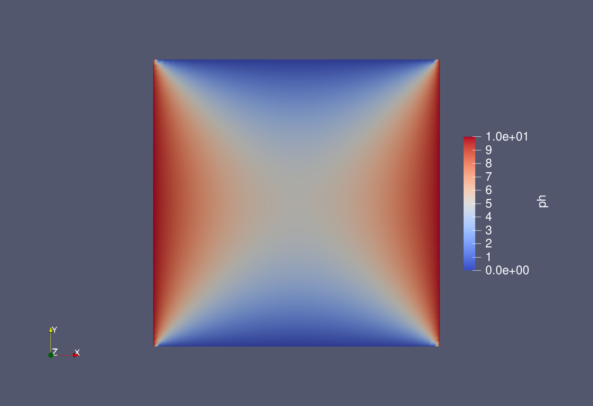

# Project 3


If you recall, in [Project 2](https://github.com/PGE383-HPC/project2) we wrote our own parallel solver for the two-dimensional Laplace equation.  In this project, we'll see how easy it is to use [Gridap](https://github.com/gridap/Gridap.jl) and [GridapDistributed](https://github.com/gridap/GridapDistributed.jl) to parallelize our code from [assignment17](https://github.com/PGE383-HPC/assignment17).  **Note:** The "steady-state pressure diffusivity" equation is the Laplace equation if $\lambda(\vec{x}) = 1$.

You should be able to use your [assignment17](https://github.com/PGE383-HPC/assignment17) solution, along with [this tutorial](https://gridap.github.io/Tutorials/dev/pages/t016_poisson_distributed/), making only minor changes to each to get this working.

Specifically, the function you must implement is the `fe_solver()` function in [project3.jl](src/project3.jl).  This function should return the Gripap solution object (i.e. the thing returned by `solve()`).  

You can run this code in parallel with the following command from the repository root directory

```
$HOME/.julia/bin/mpiexecjl -np 4 julia --project src/project3.jl
```


## Tips

 * When constructing your `TestFESpace` use the `dirichlet_tags="boundary"`
     then implement a function (of `x` where `x` is a `Vector`) to find the
     left and right boundaries and apply the constant boundary conditions that
     are supplied as the arguments `left_bc` and `right_bc` in the arguments to
     `fe_solver`.

 * Assign the output of `solve()` to a variable called `ph`, this will allow
     for writing the output files for visualization.

 * The arguments `nx` and `ny` in `fe_solver` are the number of elements for
     the discretiziation in the `x` and `y` directions respectively.  Use some
     logic to ensure the distribution of elements across the parallel
     partitions is correct.  You may assume that the `nx` and `ny` will always
     be evenly divisible by the number of processors for simplicity.

## Visualization in ParaView

If you set the argument `write_plot_files=true` in `fe_solver` the code at the
bottom of `fe_solver` will write out plot files in parallel.  You can then use
the open source tool [Paraview](https://www.paraview.org/) for visualization.
Unfortunately, you cannot use this from our web-based development environment so
you must download the files to you local computer.  First, on the Terminal
command line in the repository directory, run

```bash
zip -r results* ./results/*
```

Once you do that, in the file browser, right-click `results.zip` and select
"Download".  This will download the file your local computer.  Once you have it
downloaded, you can unzip it locally, either by running

```bash
unzip results.zip
```

in a Terminal session or by simply double-clicking the file on most operating
systems.  Now you're ready to open them in Paraview.

If you don't have Paraview installed, it can be downloaded [here](https://www.paraview.org/download/) for all major operating systems.

Open the `results.pvtu` file from within Paraview and click "Apply" in the Properties tab on the left-hand side of the screen.  Then you should be able to change the selection from "Solid Color" to "ph" at the top to see something
like the image below (for `left_bc=10` and `right_bc=10`).


